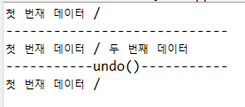

# Command 패턴

> 실행될 기능을 캡슐화함으로써 주어진 여러 기능을 실행할 수 있는 재사용성이 높은 클래스를 설계하는 패턴

- 이벤트가 발생했을 때, 실행될 기능이 다양하면서도 변경이 필요한 경우에 이벤트를 발생시키는 클래스를 변경하지 않고 재사용하고자 할 때 유용
- 실행될 기능을 캡슐화함으로써 기능의 실행을 요구하는 호출자(Invoker) 클래스와 실제 기능을 실행하는 수신자(Receiver)클래스 사이의 의존성을 제거
- 따라서, 실행될 기능의 변경에도 호출자 클래스를 수정없이 그대로 사용할 수 있게 해줌


## Command 패턴 참여 객체


<br>

### 1. Command

- 실행될 기능에 대한 인터페이스
- 실행될 기능을  execute  메서드로 선언


### 2. ConcreteCommand

- 실제로 실행되는 기능 구현
  - 즉,  Command라는 인터페이스를 구현
  - execute메서드 구현필요
- Receiver 객체와 액션 간의 연결성 정의


### 3. Invoker

- 기능의 실행을 요청하는 호출자 클래스


### 4. Receiver

- ConcreteCommand에서 execute메서드를 구현할 때 필요한 클래스
  - 즉, ConcreteCommand의 기능을 실행하기 위해 사용하는 수신자 클래스

### 5. Client

- ConcreteCommand 객체를 생성하고 처리 객체로 정의


## Command 패턴 예시

###  ex) 만능 버튼 만들기

> 버튼이 눌리면 램프의 불이 켜지는 프로그램


- Button클래스는 Command 인터페이스의 execute메서드를 호출
  - 램프를 켜는 경우 theLamp.turnOn메서드 호출 pressed메서드 수정
  - 알람이 울릴 경우 theAlarm.start메서드 호출햐  pressed메서드 수정
- LampOnCommand클래스에서는 Command인터페이스의 execute메서드 구현
  - Lamp클래스의 turnOn메서드(램프켜는 기능) 호출
- AlarmStartCommand클래스에서는 Command인터페이스의 execute매서드 구현
  - Alarm클래스의 start메서드(알람 울리는 기능)호출


### Command 인터페이스

```java
package Command;

// command 인터페이스
public interface Command {
	public abstract void execute();
}

```


### Button 클래스

```java
package Command;

public class Button {
	private Command theCommand;
	
	// 생성자에서 버튼을 눌렀을 때, 필요한 기능을 인자로 받는다.
	public Button(Command theCommand) {
		setCommand(theCommand);
	}
	
	public void setCommand(Command newCommand) {
		this.theCommand = newCommand;
	}
	
	// 버튼이 눌리면 주어진 Command의 execute메서드 호출
	public void pressed() {
		theCommand.execute();
	}
	
}

```

- Command인터페이스를 구현하는 LampOnCommand와 AlarmCommand객체를 Button객체에 설정
- Button클래스의 pressed메서드에서 Command인터페이스의 execute메서드 호출
  - 즉, 버튼을 눌렀을 때 필요한 임의의 기능은 Command 인터페이스를 구현한 클래스의 객체를 Button객체에 설정해서 실행할 수 있음
  - Button클래스의 코드를 변경하지 않고 다양한 동작 구현 가능


### LampOnCommand 클래스

```java
package Command;

// 램프를 켜는 LampOnCommand클래스
public class LampOnCommand implements Command{
	private Lamp theLamp;
	
	public LampOnCommand(Lamp theLamp) {
		this.theLamp = theLamp;
	}
	
	// Command인터페이스의 execute메서드
	public void execute() {
		theLamp.turnOn();
	}
	
}

```


### Lamp 클래스

```java
package Command;

public class Lamp {
	public void turnOn() {
		System.out.println("Lamp On");
	}
}

```


### AlarmStartCommand 클래스

```java
package Command;

// 알람 울리는 AlarmStartCommand 클래스
public class AlarmStartCommand implements Command{
	private Alarm theAlarm;
	
	public AlarmStartCommand(Alarm theAlarm) {
		this.theAlarm = theAlarm;
	}
	
	// Command 인터페이스의 execute 메서드
	public void execute() {
		theAlarm.start();
	}
}

```


### Alarm 클래스

```java
package Command;

public class Alarm {
	public void start() {
		System.out.println("Alarming");
	}
}

```


### Client 클래스

```java
package Command;

// 클라이언트에서 lamp, alarm사용
public class Client {
	public static void main(String[] args) {
		Lamp lamp = new Lamp();
		Command lampOnCommand = new LampOnCommand(lamp);
		
		Alarm alarm = new Alarm();
		Command alarmStartCommand = new AlarmStartCommand(alarm);
		
		// 램프켜는 Command 설정
		Button button1 = new Button(lampOnCommand);
		button1.pressed(); // 램프켜는 기능 수행
		
		// 알람 울리는 Command 설정
		Button button2 = new Button(alarmStartCommand);
		button2.pressed(); // 알람 울리는 기능 수행
		button2.setCommand(lampOnCommand); // 다시 램프 켜는 Command설정
		button2.pressed(); // 램프켜는 기능 수행
	}
}

```


### 결과


# Interpreter 패턴

> 간단한 언어의 문법을 정의하고 해석하는 패턴

- 데이터를 주고 받을 때, 데이터의 패턴(문법)을 객체화하여 언어 해석
- 간단한 문법적 규칙(대체로 문자열을 해석하는)을 클래스화하여 사용자가 원하는 답을 얻게 해주는 패턴
- 주로 SQL, shell 명령어 해석기, 통신 프로토콜 등에 사용


## Interpreter 패턴 참여객체


- 표현(Expression) interface(혹은abstract class)를 생성하고 Expression인터페이스를 구현하는 구상 클래스 생성

### 1. Context

- 문장을 저장하고 관리하는 클래스
- 스크립트에 대한 문자열을 받아 처리하는 클래스
- 입력을 해석해주는 역할


### 2. Abstract Expression

- 문장을 해석하기 위한 해석자 인터페이스


### 3. Terminal Expression(Concrete Expression)

- 문장의 종료를 나타내는 해석자 클래스 구현체


### 4. Non-Terminal Expression(Concrete Expression)

- 문장의 비종료를 나타내는 해석자 클래스 구현체


### 5. Client


## Interpreter 패턴 예시

### ex) 연산자 해석기(후위 표기법 구현)


- "w x z - +"라는 문장을 Evaluator라는 문법해석기에 넣을 때, Evaluator는 문장을 해석해 계산이 가능한 계산기 출력
- 이 계산기에 사용자가 원하는대로 문자=10(w=10)과 같이 입력을 넣어주면 37이라는 답을 얻을 수 있음


### Expression 인터페이스

```java
package Interpreter;

import java.util.Map;

// 만들 연산자들
public interface Expression {
	// 어떻게 해석할지 구현
	public int interpret(Map<String, Expression> variables);
}

```


### Plus 클래스

```java
package Interpreter;

import java.util.Map;

// Plus 연산자 구현
public class Plus implements Expression {
	// +의 왼쪽에 올 표현(숫자일수도, 이미 연산된 결과일수도 있음)
	Expression leftOperand;
	// +의 오른족에 올 표현
	Expression rightOperand;
	
	public Plus(Expression leftOperand, Expression rightOperand) {
		this.leftOperand = leftOperand;
		this.rightOperand = rightOperand;
	}

	@Override
	public int interpret(Map<String, Expression> variables) {
		// 왼쪽과 오른족의 결과를 더해서 반환
		return leftOperand.interpret(variables)+rightOperand.interpret(variables);
	}
	
	

}

```


### Minus 클래스

```java
package Interpreter;

import java.util.Map;

public class Minus implements Expression{
	// -의 왼쪽에 올 표현(숫자일수도, 이미 연산된 결과일 수도 있음)
	Expression leftOperand;
	// +의 왼쪽에 올 표현(숫자일수도, 이미 연산된 결과일 수도 있음)
	Expression rightOperand;
	
	public Minus(Expression leftOperand, Expression rightOperand) {
		this.leftOperand = leftOperand;
		this.rightOperand = rightOperand;
	}

	@Override
	public int interpret(Map<String, Expression> variables) {
		return leftOperand.interpret(variables)-rightOperand.interpret(variables);
	}
	
	
}

```


### Variable 클래스(알파벳에 해당)

```java
package Interpreter;

import java.util.Map;

public class Variable implements Expression{
	private String alphabet;
	
	public Variable(String alphabet) {
		this.alphabet = alphabet;
	}

	@Override
	public int interpret(Map<String, Expression> variables) {
		// 사용자가 입력한 Map에 alphabet이 있으면 그 알파벳에 해당하는 숫자 반환
		// 없으면 0반환
		if(variables.get(alphabet) == null) {
			return 0;			
		}
		return variables.get(alphabet).interpret(variables);
	}
}

```


### Number 클래스(사용자가 입력한 숫자)

```java
package Interpreter;

import java.util.Map;

public class Number implements Expression{
	private int num;
	
	public Number(int num) {
		this.num = num;
	}

	@Override
	public int interpret(Map<String, Expression> variables) {
		return num; // 숫자 반환
	}
	
	
}

```


### Evaluator 클래스(해석기)

```java
package Interpreter;

import java.util.Map;
import java.util.Stack;

// 후위 연산법은 스택을 통해 구현
public class Evaluator implements Expression{
	private Expression sysntax; 
	
	public Evaluator(String expression) {
		// expression을 입력받음
		Stack<Expression> stack = new Stack<Expression>();
		
		for(String strToken : expression.split(" ")) {
			if(strToken.equals("+")) {
				Expression expressionPlus = new Plus(stack.pop(), stack.pop());
				stack.push(expressionPlus);
			} else if(strToken.equals("-")) {
				Expression expressionMinus = new Minus(stack.pop(), stack.pop());
				stack.push(expressionMinus);
			} else {
				stack.push(new Variable(strToken));
			}
		}
		// 해석 결과로 나온 계산기
		sysntax = stack.pop();
	}

	@Override
	public int interpret(Map<String, Expression> variables) {
		return sysntax.interpret(variables);
	}
	
	
}

```


### Client 클래스

```java
package Interpreter;

import java.util.HashMap;
import java.util.Map;

public class Client {
	public static void main(String[] args) {
		// 해석을 원하는 문장
		String expression = "w x z - +";
		
		// 문장에 다른 해석기 제작
		Evaluator sentence = new Evaluator(expression);
		
		// 사용자가 w = 5, x = 10, z = 42를 입력
		Map<String, Expression> variables = new HashMap<String, Expression>();
		variables.put("w", new Number(5));
		variables.put("x", new Number(10));
		variables.put("z", new Number(42));
		
		// 해석기에 입력을 넣고 결과 얻기
		int result = sentence.interpret(variables);
		System.out.println(result);
	}
}

```


### 결과


# Iterator 패턴	

> 컬렉션 구현 방법을 노출시키지 않으면서도 그 집합체 안에 들어잇는 모든 항목에 접근할 수 있게 해 주는 방법을 제공해주는 패턴


## Iterator패턴 참여객체


### 1. Iterator

- 요소를 순서대로 검색해가는 인터페이스
- 다음 요소가 존재하는지를 얻기 위한 hasNext메서드와 다음 요소를 얻기 위한 next메서드를 결정


### 2. ConcreteIterator

- Iterator인터페이스의 구현체
- 순회 과정 중에 집합 객체 내의 현재 위치를 기억
- 검색하기 위한 필요한 정보를 가지고 있어야 함


### 3. Aggregate

- Iterator 역할을 만들어내는 인터페이스


### 4. ConcreteAggregate

- Aggregate 인터페이스의 구현체
- 해당하는 ConcreteIterator의 인스턴스를 반환하도록 Iterator생성 인터페이스를 구현


## Iterator 패턴 예시

### ex) BookShelf 예제

- 책꽂이 안에 책을 꽂고, 다시 책을 하나씩 확인하는 예제


### Book 클래스

- 한 권의 책에 대한 정보를 가지고 있는 클래스

```java
package Iterator;

public class Book {
	private String name;
	
	public Book(String name) {
		this.name = name;
	}
	
	public String getName() {
		return name;
	}
}

```


### Aggregate 인터페이스

- Aggreate는 Iterator 역할을 만들어내는 인터페이스 결정

```java
package Iterator;

import java.util.Iterator;

public interface Aggregate {
	public abstract Iterator createIterator();
}

```


### BookShelf 클래스

- 책을 보관하는 책꽂이 역할을 하는 클래스

```java
package Iterator;

import java.util.Iterator;

public class BookShelf implements Aggregate{
	private Book[] books; // 책의 집합
	
	private int last = 0; // 마지막 책이 꽂힌 위치
	
	public BookShelf(int size) {
		books = new Book[size];
	}
	
	public Book getBook(int index) {
		return books[index];
	}
	
	public int getLength() {
		return last;
	}
	
	// 책꽂이에 책을 꽂는다.
	public void appendBook(Book book) {
		if(last < books.length) {
			this.books[last] = book;
			last++;
			
		} else {
			System.out.println("책꽂이가 꽉 찼습니다.");
		}
	}

	@Override
	public Iterator createIterator() {
		
		return new BookShelfIterator(this);
	}
}

```


### BookShelfIterator 클래스

- 책꽂이에서 책을 한 권식 뽑아오는 역할

```java
package Iterator;

import java.util.Iterator;

public class BookShelfIterator implements Iterator<Book>{
	private BookShelf bookShelf; // 검색을 수행할 책꽂이
	private int index = 0; // 현재 처리할 책의 위치
	
	public BookShelfIterator(BookShelf bookShelf) {
		this.bookShelf = bookShelf;
	}

	@Override
	public boolean hasNext() { // 검색을 계속 수행해도 될지의 여부를 판별
		return index < bookShelf.getLength();
	}

	@Override
	public Book next() { // 다음번 요소 반환
		Book book = bookShelf.getBook(index);
		index++;
		return book;
	}
}

```


### Client 클래스

- 책꽂이에 책을 꽂고 책을 하나씩 검색해 이름 출력

```java
package Iterator;

import java.util.Iterator;

public class Client {
	public static void main(String[] args) {
		BookShelf bookShelf = new BookShelf(10);
		
		Book book1 = new Book("Bibe");
		Book book2 = new Book("Cinderella");
		Book book3 = new Book("Daddy-Long-Legs");
		
		bookShelf.appendBook(book1);
		bookShelf.appendBook(book2);
		bookShelf.appendBook(book3);
		
		System.out.println("현재 꽂혀있는 책 : "+bookShelf.getLength()+"권");
		
		// 검색할 책이 존재하는 동안 while문이 수행
		Iterator it = bookShelf.createIterator();
		while(it.hasNext()) {
			// 한 권씩 첵을 꺼내 이름 출력
			Book book = (Book) it.next();
			System.out.println(book.getName());
		}
		
	}
}

```


### 결과


# Mediator 패턴

> 모든 클래스 간의 복잡한 로직(상호작용)을 캡슐화하여 하나의 클래스에 위임하여 처리

- 즉, M:N의 관계에서 M:1의 관계로 복잡도를 덜어드려 유지 보수 및 재사용의 확장성에 유리한 패턴
- 즉, 커뮤니케이션을 하고자 하는 객체가 있을 때, 서로가 커뮤니케이션하기 복잡한 경우 이를 해결해주고 서로 간 쉽게 해주며 결합을 약화시켜주는 패턴

- 비슷한 패턴 : Observer 패턴
  - Observer 패턴 : **한 객체**의 이벤트를 여러 객체가 구독
  - Mediator 패턴 : **서로 다른 객체**의 이벤트를 서로 구독


## Mediator 패턴 참여객체

### 1. Mediator

- 여러 Component를 중재해주는 인터페이스를 가지고 있는 추상 클래스 객체


### 2. ConcreteMediator

- Component 객체들을 가지고 있으면서 중재해주는 역할을 하는 객체


### 3. Colleague

- Mediator 객체에 의해서 관리 및 중재를 받을 기본 클래스 객체들


## Mediator 패턴 예시

### ex) 채팅 구현하기


- ConcreteColleague1, ConcreteColleague2, ConcreteColleague3은 User, Admin, System에 해당하는 클래스
- Colleague클래스를 상속받아 통신에 필요한 메서드 구현
- User는 메세지를 받을 수 있으나, Admin/System은 보내는 것만 가능


### Colleague 클래스

```java
package Mediator;

// 다른 객체와 통신을 하는 요소
// 예제의 User, Admin, System의 추상적인 요소에 해당
// 통신에 필요한 메서드를 가지고 있음
// 다른 객체와의 통신은 직접하지 않으며, Mediator객체를 통해 요청을 하는 방식으로 통신

public abstract class Colleague {
    private Mediator mediator;
    protected String name;
    private String message;

    public Colleague(String name){
        this.name = name;
    }

    public void setMediator(Mediator mediator) {
        this.mediator = mediator;
    }

    public String getName() {
        return this.name;
    }

    public void setMessage(String message) {
        this.message = message;
    }

    public String getMessage(){
        return this.message;
    }

    public void send() {
        System.out.println(this.name + " send()");
        System.out.println();
        mediator.mediate(this);
    }

    public abstract void receive(Colleague colleague);
}

```


### ConcreteColleague1 클래스

- User

```java
package Mediator;

public class ConcreteColleague1 extends Colleague {

 public ConcreteColleague1(String name) {
     super(name);
 }

 @Override
 public void receive(Colleague colleague) {
     System.out.println(this.name + " recevied " + colleague.getName() + "'s Message : " + colleague.getMessage());
 }
}

```


### ConcreteColleague2 클래스

- System

```java
package Mediator;

public class ConcreteColleague2 extends Colleague {

 public ConcreteColleague2(String name) {
     super(name);
 }

 @Override
 public void receive(Colleague colleague) {
     System.out.println("System can't receive messages");
 }
}

```


### ConcreteColleague3 클래스

- Admin

```java
package Mediator;

public class ConcreteColleague3 extends Colleague {

 public ConcreteColleague3(String name) {
     super(name);
 }

 @Override
 public void receive(Colleague colleague) {
     System.out.println("Admin can't receive messages");
 }
}

```


### Mediator 인터페이스

- 객체 간의 통신을 중재하는 인터페이스

```java
package Mediator;

// 통신의 대상이 되는 Colleague를 추가하는 메서드 존재 필요
public interface Mediator {
    void addColleague(Colleague colleague);
    void mediate(Colleague colleague);
}

```


### ConcreteMediator 클래스

- Mediator를 구현하는, 실질적으로 중재하는 로직을 가지는 클래스

```java
package Mediator;

import java.util.ArrayList;
import java.util.List;

// 서로 통신하는 객체들을 가지고 있어야 하며, 특정 Colleague로부터 요청이 들어오면, 상대 Colleague를 찾아서 해당 메세지를 전달
// Mediator는 Colleague에 대한 레퍼런스를 가지고 있고, Colleague는 Mediator에 대한 레퍼런스를 가지고 있음
// 양방향 연관관계를 가짐
public class ConcreteMediator implements Mediator {
    private List<Colleague> colleagueList;

    public ConcreteMediator() {
        this.colleagueList = new ArrayList<Colleague>();
    }

    @Override
    public void addColleague(Colleague colleague) {
        this.colleagueList.add(colleague);
    }

    @Override
    public void mediate(Colleague colleague) {
        for(Colleague receiverColleague : colleagueList) {
            System.out.println("\tMediating " + colleague.getName() + " to " + receiverColleague.getName());
            receiverColleague.receive(colleague);
        }
    }
}
```


### Client 클래스

```java
package Mediator;

public class Client {
	public static void main(String[] args) {
		Mediator mediator1 = new ConcreteMediator();
        Colleague colleague1 = new ConcreteColleague1("User1");
        Colleague colleague2 = new ConcreteColleague1("User2");
        Colleague colleague3 = new ConcreteColleague2("System");
        Colleague colleague4 = new ConcreteColleague3("Admin");

        colleague1.setMediator(mediator1);
        colleague2.setMediator(mediator1);
        colleague3.setMediator(mediator1);
        colleague4.setMediator(mediator1);

        mediator1.addColleague(colleague1);
        mediator1.addColleague(colleague2);
        mediator1.addColleague(colleague3);
        mediator1.addColleague(colleague4);

        colleague1.setMessage("I'm User1");
        colleague1.send();
	}
}

```


### 결과


# Memento 패턴

> 객체의 상태 정보를 저장하고 사용자의 필요에 의하여 원하는 시점의 데이터를 복원할 수 있는 패턴


## Memento 패턴 참여객체


### 1. Memento

- Originator의 상태 저장
  - Originator 역할의 내부 정보를 정리
- Originator역할의 내부 정보를 가지고 있지만, 그 정보를 누구에게도 공개하지 않음


### 2. Originator

- 상태를 저장하고 복원할 객체의 주체
- 자신의 현재 상태를 저장하고 싶을 대 Memento역할을 만듦
- 이전의 Memento역할을 전달받으면 그 Memento역할을 만든 시점의 상태로 돌리는 처리 실행


### 3. Caretaker(관리인)

- 현재의 Originator 역할 상태를 저장하고 싶을 때, 그것을 Originator역할에게 전달
  - Originator역할은 그것을 받아 Memento역할을 만들어 Caretaker역할에게 전달


## Memento 패턴 예시

### ex) 텍스트 편집기

- 글을 저장기능
- 마지막으로 저장했던 글로 되돌리는 기능


### FileWriterUtil 클래스

```java
package Memento;

// Originator 클래스
public class FileWriterUtil {
	private String fileName;
	private StringBuilder content;
	
	public FileWriterUtil(String fileName) {
		this.fileName = fileName;
		this.content = new StringBuilder();
	}

	@Override
	public String toString() {
		return this.content.toString();
	}
	
	public void write(String str) {
		this.content.append(str);
	}
	
	public Memento save() {
		return new Memento(this.fileName,this.content);
	}
	
	public void undoToLastSave(Object obj) {
		Memento memento = (Memento) obj;
		this.fileName = memento.fileName;
		this.content = memento.content;
	}
	
	// Memento 클래스
	private class Memento{
		private String fileName;
		private StringBuilder content;
		
		public Memento(String fileName, StringBuilder content) {
			this.fileName = fileName;
			// deep copy를 사용해서 FileWriterUtil의 content 변수와 동일한 레퍼런스를 갖지 않도록 함
			this.content = new StringBuilder(content);
		}
	}
	
}

```


### FileWriterCaretaker 클래스

```java
package Memento;

// Caretaker 클래스는 이전 객체의 상태를 갖는 Object 클래스를 구성하고 있음
public class FileWriterCaretaker {
	// Memento 클래스를 구성하고 있음
	private Object object;
	
	public void save(FileWriterUtil fileWriterUtil) {
		this.object = fileWriterUtil.save();
	}
	
	public void undo(FileWriterUtil fileWriterUtil) {
		fileWriterUtil.undoToLastSave(object);
	}
}

```


### Client 클래스

```java
package Memento;

public class Client {
	public static void main(String[] args) {
		FileWriterCaretaker caretaker = new FileWriterCaretaker();
		
		FileWriterUtil fileWriter = new FileWriterUtil("data.txt");
		
		fileWriter.write("첫 번재 데이터 / ");
		System.out.println(fileWriter);
		
		System.out.println("----------------------------");
		
		// 파일 저장
		caretaker.save(fileWriter);
		
		// 다른 데이터 작성
		fileWriter.write("두 번째 데이터");
		
		// 현재 파일의 데이터 출력
		System.out.println(fileWriter);
		
		// 작성했던 데이터 되돌리기
		caretaker.undo(fileWriter);
		
		System.out.println("-----------undo()-----------");
		
		// 현재 파일의 데이터 출력
		System.out.println(fileWriter);
		
	}
}

```


### 결과


